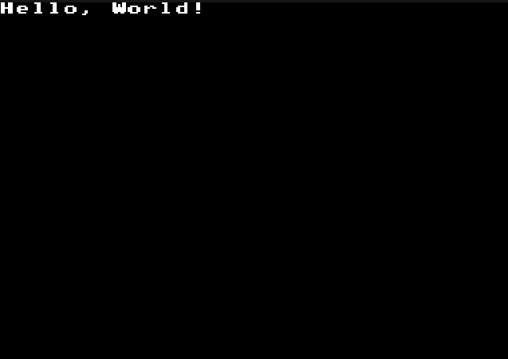

# asm68k-megadrive-helloworld-again
A reworked and simpler hello world for the Sega Megadrive.

Loads a font set into VRAM and writes a string to the screen

A few handy macros are used



The code is fairly heavily commented.  I have written this primarily as a refresher for myself having not touched Megadrive 68K assembly for a good few years.

This ROM runs in NTSC H32/V30 mode (256 x 224).


# Building
Use ```make``` to build the rom

Requires GNU Assembler a.k.a. GNU AS / GAS and requires GNU Linker for m68k.

These are known to be available in the default repos for SuSELeap and Ubuntu.

In Leap simply install ```cross-m68k-binutils```

# Some Handy new links at the time of writing
https://github.com/Clownacy/clownmdemu-frontend - Super handy emulator with excellent VDP debug and works perfectly on Linux

https://rasterscroll.com/mdgraphics/vdp-inner-workings/ - Excellent description of the VDP
